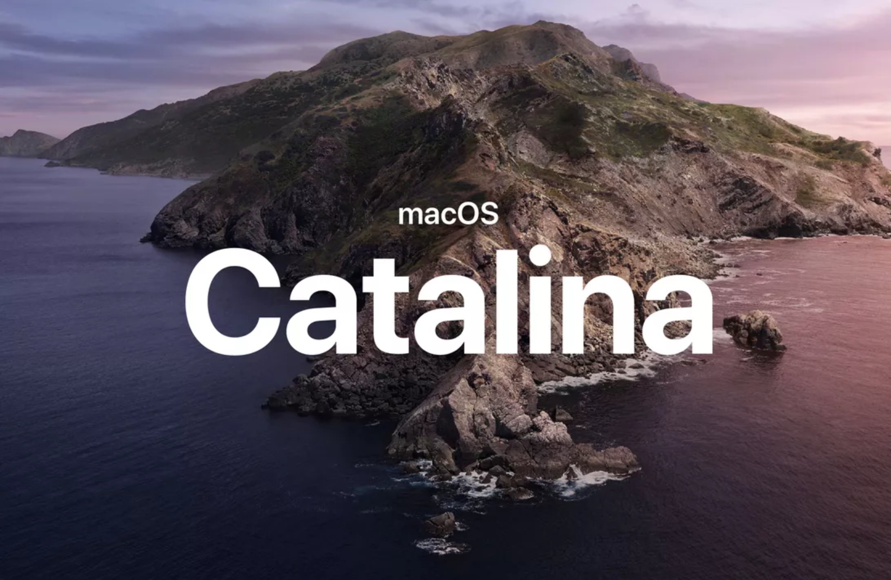

<figure>

<figcaption>macOS Catalina has new app validation requirements, and Dwigt is ready!</figcaption>
</figure>

Ready to jump on macOS Catalina? Dwigt has you covered with our latest update featuring Catalina support and [Apple's latest notarization](https://developer.apple.com/documentation/xcode/notarizing_macos_software_before_distribution) for improved security validation in prior operating systems.
