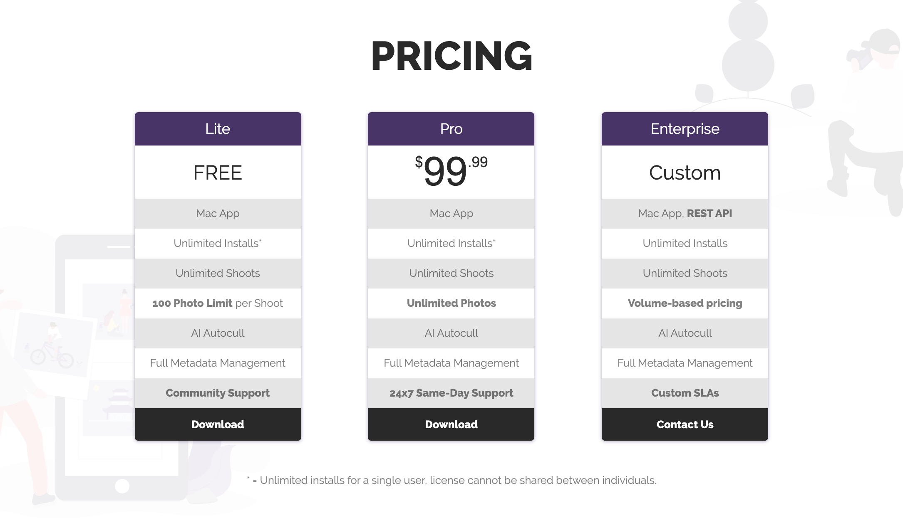

As we begin to move out of beta, pricing details are finally here! We're excited to provide a free tier for enthusiasts, an unlimited trial experience for professionals, and reject monthly subscription models for Optyx v1. You don't provide a credit card until you're _confident_ Optyx works for _YOU_!

To that end, Optyx will be available in three editions:

- Free Forever
- Pro
- Enterprise

<figure>

<figcaption>Free forever, enterprise pricing available</figcaption>
</figure>

### Free Forever

Free Forever is, as the name suggests, free to use and evaluate for as long as you like. Limits are placed on the number of photos that can be stored in a single shoot, but other app functionality is unrestricted to get the full Optyx experience.

### Pro

Pro removes all limitations on the Free edition and can be installed on as many computers as you need for an individual license. Organizations or those that need multiple users to access Optyx should consider Enterprise. The Pro edition is a **one-time** \$99 payment and provides access to all future updates on the same major version.

### Enterprise

Enterprise edition offers multi-user licenses and programmatic access to Optyx analysis. Pricing is usage-based and varies based on volume and support requirements. Contact [sales@optyx.app](mailto:sales@optyx.app) for more information.
