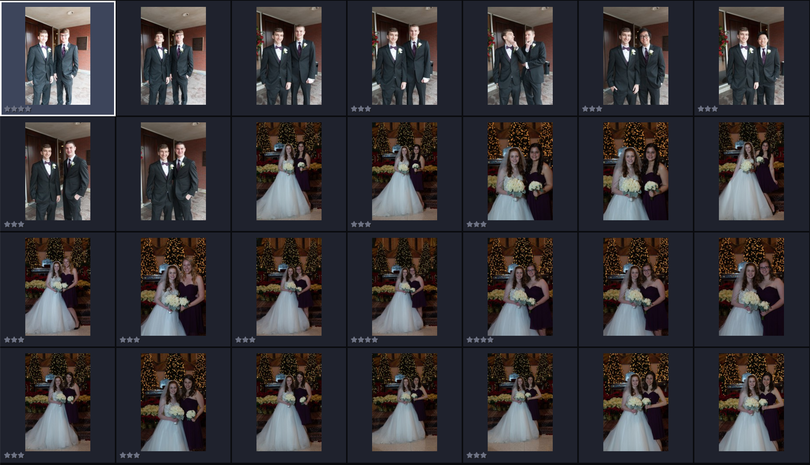

We're excited to announce a new autocull feature for Optyx called "face combinations"!

Here's how it works. When a photo group is detected containing different sets of faces, the "Best of Face Combination" label will be added to the photo that's "Best Overall" of each unique group of people.

This feature is an ideal fit for staged wedding portraits with identical backgrounds and other similar portrait situations that swap folks in and out without backdrop changes.

<figure>

<figcaption>Use the "Portraits" preset to keep one from each face combination</figcaption>
</figure>

In the future we hope to extend the reach of this functionality into autogroup sliders, face-based filtering, and subject identification. Let us know what you think and happy culling!
