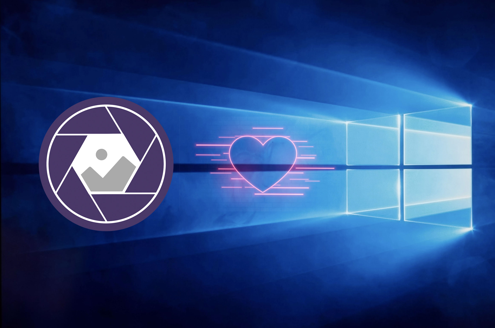

Hello, Windows! Optyx now has you covered with our latest update bringing first-class Windows 10 support. The team has been hard at work ensuring widespread compatibility.

[Download the Windows installer now](https://www.optyx.app/download?platform=windows).

<figure>

<figcaption>Optyx is now Windows-ready 🎉</figcaption>
</figure>

For details, check out the minimum system requirements below.

|                    | Requirement                                                            |
| ------------------ | ---------------------------------------------------------------------- |
| Processor          | Intel® or AMD processor with 64-bit support; 2 GHz or faster processor |
| Operating system   | Microsoft Windows 10\* with 64-bit support (Version 1803 or later)     |
| RAM                | 4 GB of RAM (8 GB recommended)                                         |
| Hard drive         | 2 GB of available hard-disk space for program installation             |
| Monitor resolution | 1024 x 768 display                                                     |
| Internet           | Internet connection required for Optyx Pro software activation         |

Let us know what you think and happy culling!
