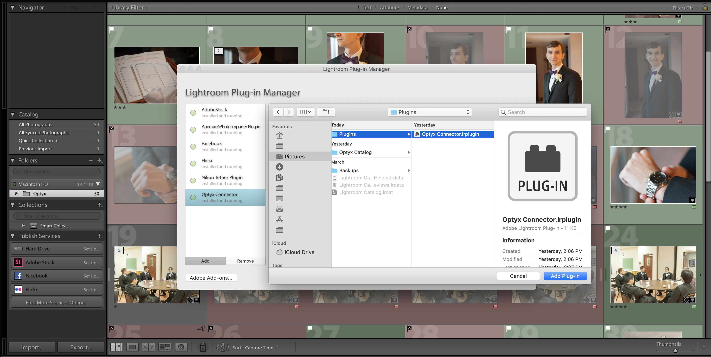
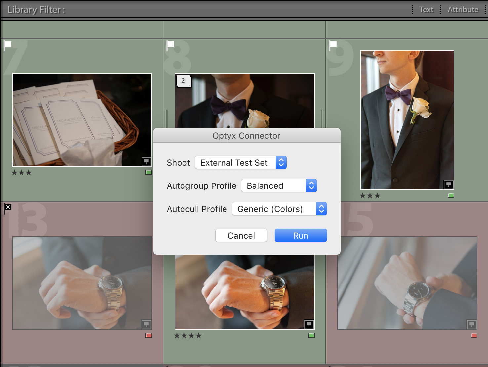

We're very excited to announce that we've unveiled the alpha version of our [Lightroom plugin](/tutorials/working-with-lightroom/#optyx-connector)! Optyx Pro users can get started using the Optyx Connector for Lightroom immediately using the [official download link on your Optyx Pro receipt](https://customers.gumroad.com/article/199-how-do-i-access-my-purchase).

### Features

Optyx was designed from the ground up to work in tandem with Lightroom even without a plugin. A vast majority of the scenarios the plugin offers can be accomplished using the standalone app. However, the Optyx Connector does provide a few unique features:

- Autocull photos without leaving Lightroom.
- Set "Flagged/Rejected" state in Lightroom through Optyx "Picked" results.
- Automatically create a new shoot and begin Optyx import with one click.

Let us know what you think and happy culling!
