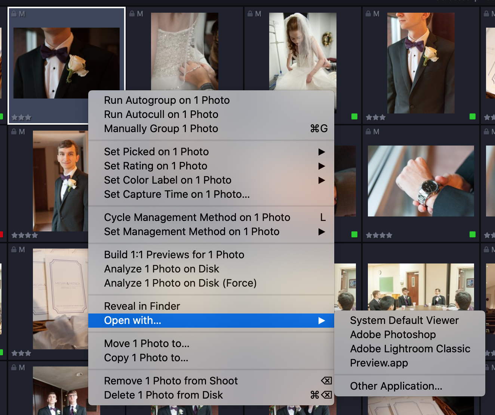

We're very excited to announce the release of Optyx `v1.1` and a slew of highly requested features from users like you! Insider Preview users should already see these features in `v1.1.0` and all Optyx users should start seeing these features in `v1.1.1`.

### Features

#### Lightroom Plug-in Support

Optyx Pro users have access to our alpha [Lightroom plugin](/posts/2020/04/lightroom-plugin/). Optyx `v1.1` contains the support for Lightroom connectivity. Invoke Optyx Autocull functionality from directly within Lightroom, reflect Optyx "Picked" as flagged/rejected states in Lightroom, avoid metadata conflicts, and more with the Optyx Connector for Lightroom.

#### Auto-Advance Selection

Optyx can now automatically advance your selection to the next photo after setting metadata. To enable this setting, open Optyx Preferences from the `File` menu on Windows or the `Optyx` menu on Mac and set "Auto-advance Selection" to "On". When enabled and a single photo is selected in the Focused layout, the next photo in the grid will be automatically selected once a rating, color label, or picked state is manually set.

#### Improved RAW+JPEG Support

Many photographers choose to shoot in RAW+JPEG for faster importing and culling as well as for backups. While Optyx hopefully lessens the need for this process, Optyx now supports several options for handling multiple copies of the same photograph. Read more about the options available in our [Working in RAW documentation](/tutorials/working-in-raw/#handling-rawjpeg-files-simultaneously).

#### Open with...

Jumping straight to editing in Optyx just got even easier! Right-click any photo in the photo grid and select a program under the new "Open with..." menu to open it immediately. Custom programs you open with the "Other Application..." dialog will be remembered for future use.

<figure style="width: 45%; display: inline-block">

<figcaption>Auto-advance selection and RAW+JPEG support options now in Optyx Preferences</figcaption>
</figure>

<figure style="width: 45%; display: inline-block; margin-left: 5%;">

<figcaption>Open an image with any program directly within Optyx</figcaption>
</figure>

Let us know what you think and happy culling!
