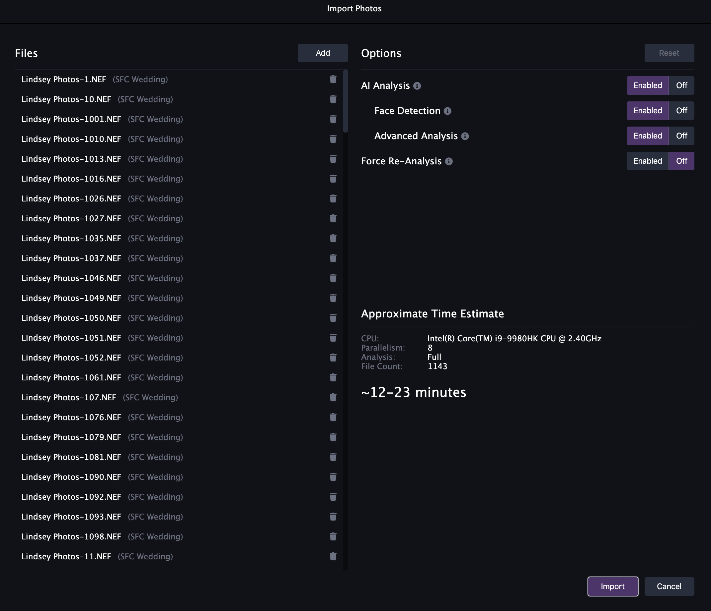

We're very excited to announce the release of Optyx `v1.2` and a slew of highly requested features and fixes from users like you!

### Features

#### Advanced Import

You asked; we listened. Import just got a whole lot smarter! Control exactly what analysis to perform or skip straight to manually culling 10x faster with advanced import controls. Estimate how long each import will take ahead of time so you can go get that coffee if your 10,000 photo wedding will take a while.

#### Mouse-Tracked Detail Pane

The v1.1 Detail pane in Optyx was fairly limited and only available after running expensive 1:1 preview generation. v1.2 introduces the newly revamped Detail pane with a new mouse-tracked preview you're familiar with from Lightroom.

<figure style="margin-left: 2.5%; width: 45%; display: inline-block">

<figcaption>Control exactly what analysis to run for advanced import control and time estimation.</figcaption>
</figure>

<figure style="width: 45%; display: inline-block; margin-left: 5%;">

<figcaption>Familiar mouse-tracked detail targeting you're used to.</figcaption>
</figure>

### Major Fixes

#### Improved Stability for Large Shoots

We've been very impressed by the size of your photo shoots, and we love that you want to cull so many photos using Optyx! Historically, Optyx started to get sluggish once you hit the ~5,000 photo mark and tended to get slower the longer it was open. We're proud to say we discovered the root cause of these issues, and Optyx should now operate as smoothly on your 10,000th photo as your 1st. We've also greatly improved the experience on low-memory devices to keep Optyx humming on the go.

#### Smarter Selection Preservation

We heard some users liked to use filters as a fine-tuned form of [Auto-Advance Selection](/posts/2020/05/release-notes-1-1-0/#auto-advance-selection), but noticed selection could disappear on photo group boundaries. We've addressed this issue and introduced smarter selection preservation when filtering or applying metadata changes that causes images to become filtered.

Let us know what you think and happy culling!
