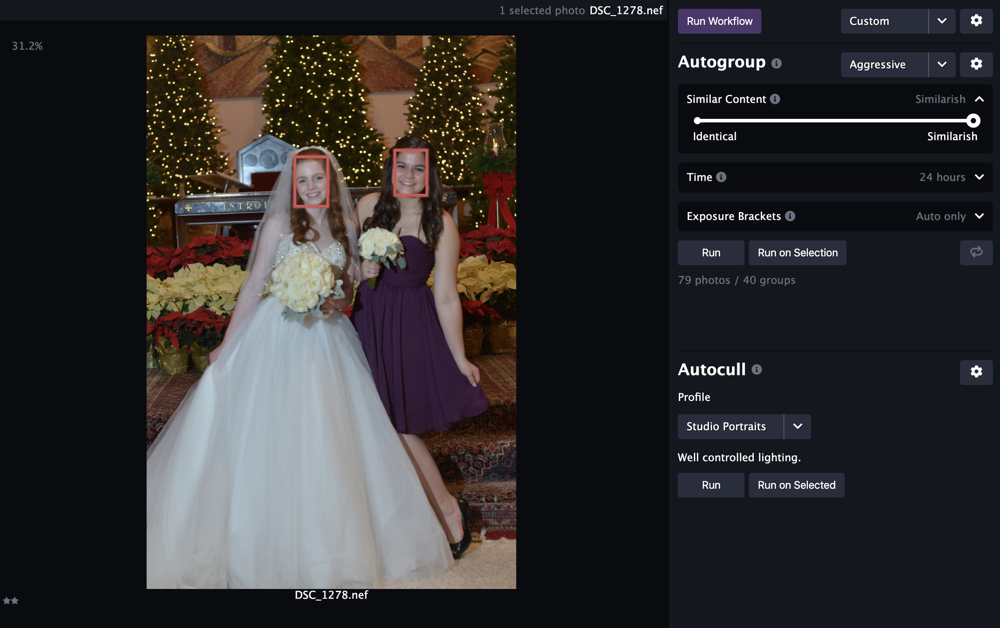
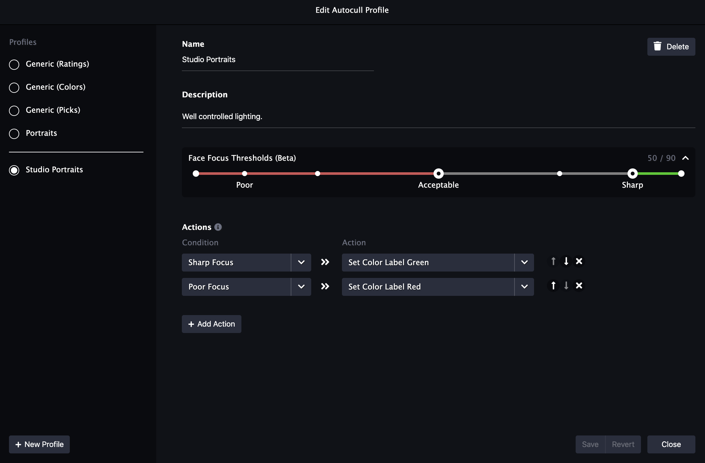
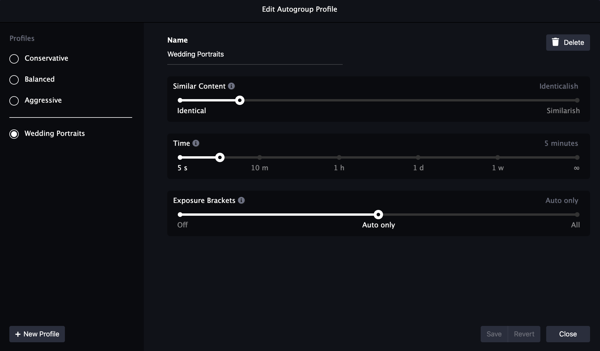
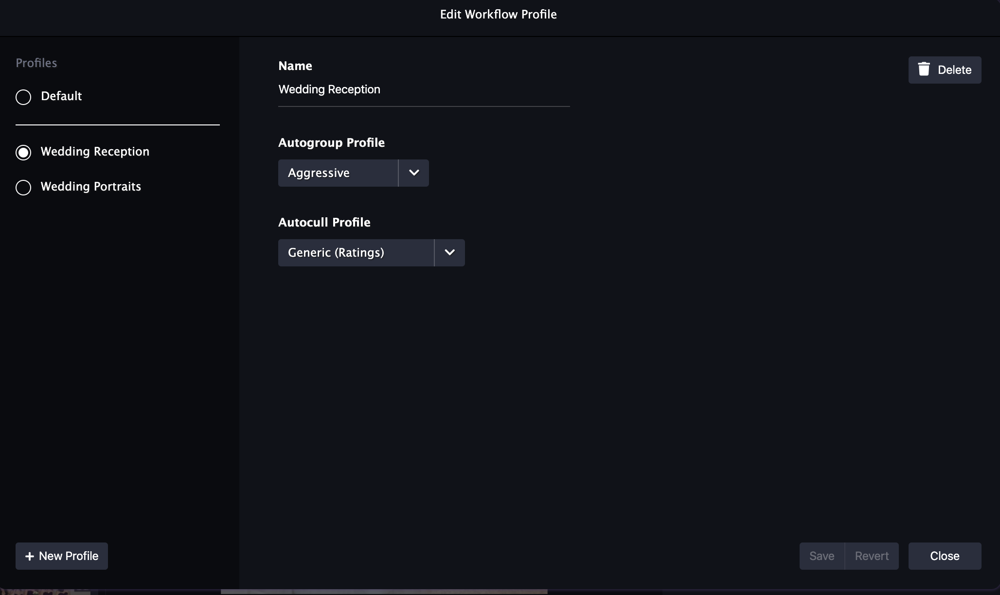
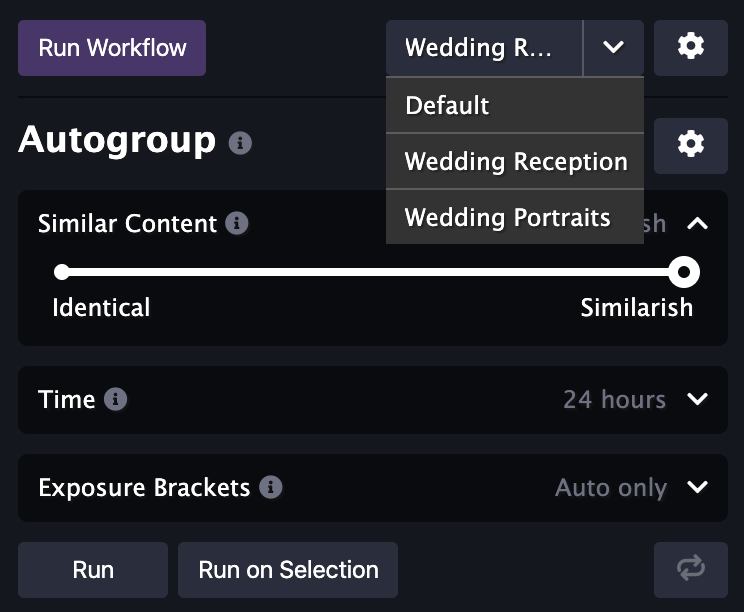

We're very excited to announce the release of Optyx `v1.3` and a cornucopia of highly requested features from users like you!

**NOTE: The features below will be unavailable for images analyzed with Optyx v1.2. Force a re-analysis or create a new shoot to take advantage of these exciting new features.**

### Face Focus Detection

Optyx will now automatically highlight out-of-focus faces with a red border when selecting a photo. You can also configure autocull profiles to apply specific XMP metadata to photos with sharp or poor focus. Read more about how to get ultimate control over face focus detection features in our [Learning Optyx guide](/tutorials/learning-optyx/#face-focus-detection).

<figure style="width: 50%; display: inline-block">

<figcaption>Example of two out-of-focus faces being highlighted in the Optyx App.</figcaption>
</figure>

<figure style="width: 40%; display: inline-block; margin-left: 5%;">

<figcaption>Face focus label threshold settings in the Optyx App.</figcaption>
</figure>

### Detail Pane Subject Suggestions

Optyx v1.2 brought you a redesigned Detail pane, and we've followed it up with even more exciting improvements: automatic detail point suggestions. Optyx v1.3 will now automatically suggest jumping to each face (or eye for larger faces) in the image for manual sharpness validation. Navigate quickly between each suggestion by using the `A` and `D` keys.

<figure>

<figcaption>Detail pane automatically suggests faces to jump to.</figcaption>
</figure>

### Autogroup Profiles

You can now save a combination in an "Autogroup Profile." Similar to autocull profiles, autogroup profiles enable you to quickly apply your preferred settings to a shoot. Open the profiles modal by clicking the settings cog in the top right corner of Autogroup and create as many custom profiles as you need.

<figure>

<figcaption>Autogroup profile settings in the Optyx app.</figcaption>
</figure>

### Workflows

With the addition of autogroup profiles, you can combine autogroup and autocull profiles into a **Workflow**. A workflow will run your prefered autogroup profile followed by your preferred autocull profile for total one-click automatic photo culling! We're really excited to see what the community does with workflows and how it improves your workflows!

<figure style="width: 60%; display: inline-block">

<figcaption>Workflow settings in the Optyx app</figcaption>
</figure>

<figure style="width: 30%; display: inline-block; margin-left: 5%;">

<figcaption>Run your workflow with a single click</figcaption>
</figure>

Let us know what you think and happy culling!
