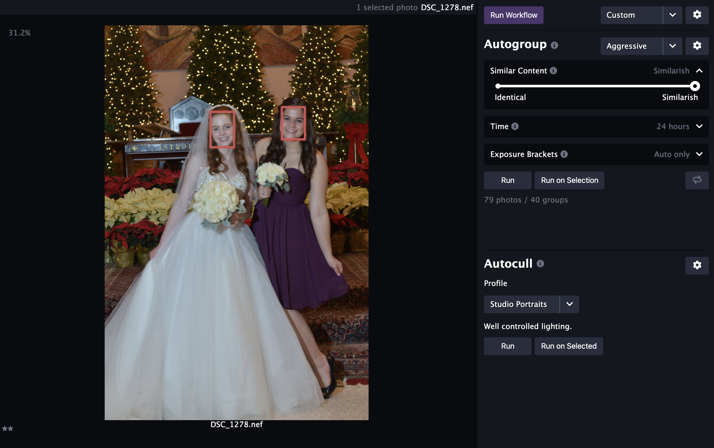

We're very excited to announce the release of Optyx `v1.4` and new usability improvements to help users like you!

### Guided Walkthrough

Optyx will now automatically walk new users through workflows and what makes Optyx so special. For veteran users, the new walkthrough can be accessed at any time through the `Help > Start Walkthrough` menu option.

<figure style="width: 40%; display: inline-block">

<figcaption>First shoot is created automatically.</figcaption>
</figure>

<figure style="width: 45%; display: inline-block; margin-left: 5%;">

<figcaption>Walkthrough wizard demonstrating autogroup functionality.</figcaption>
</figure>

### Improved Sharpness Labels

Optyx v1.3 brought you our beta of face focus detection, and we've continued to iterate on your feedback! Sharpness labels now have an updated AI model that will continue to improve over the next several releases.

<figure>

<figcaption>Example of two out-of-focus faces being highlighted in the Optyx App.</figcaption>
</figure>

Let us know what you think and happy culling!

PS - Have more ideas on what would take your Optyx experience to the next level? Drop us a line at [feedback@optyx.app](mailto:feedback@optyx.app) or checkout our [public roadmap](https://trello.com/b/tP3PX7sw/optyx-app-public-roadmap).
