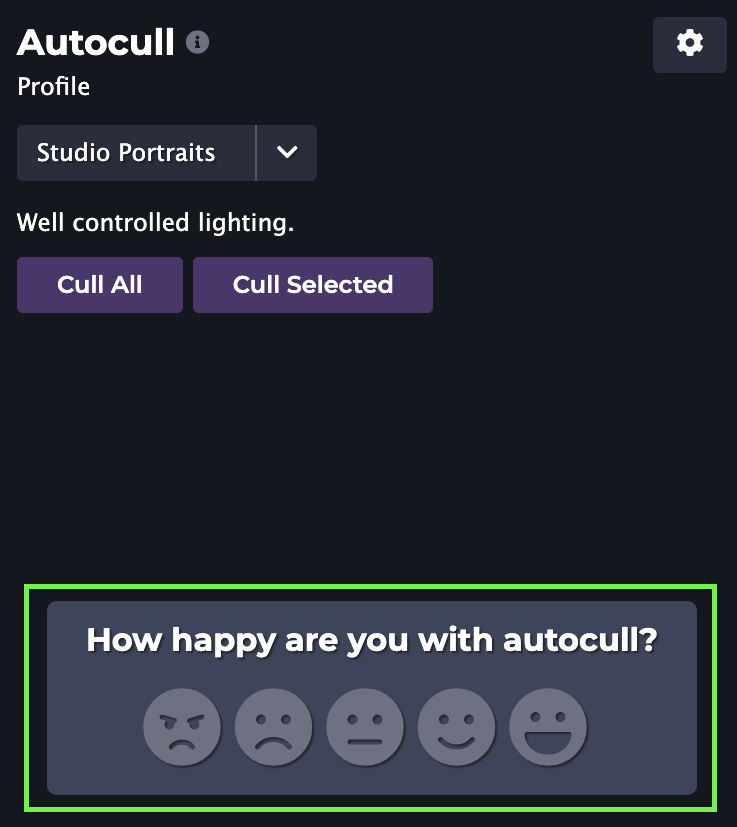

We're very excited to announce the release of Optyx `v1.5` and new accuracy improvements to help users like you!

### Improved Sharpness Labels

Optyx v1.3 brought you our beta of face focus detection, and we've continued to iterate on your feedback! Sharpness labels are now considerably more accurate. Thanks to your help we've seen accuracy rates climb from ~80% to over 95% according to our human label testers! Expect accuracy to continue to improve in novel and difficult lighting situations in future releases.

<figure>

<figcaption>Example of two out-of-focus faces being highlighted in the Optyx App.</figcaption>
</figure>

### Autocull Feedback

Optyx will now prompt you to provide your feedback on autocull results as you review images. With your help we can continue to learn from the areas to improve and improve accuracy in this arena as well.

<figure>

<figcaption>Give your feedback to help improve autocull results.</figcaption>
</figure>

Let us know what you think and happy culling!

PS - Have more ideas on what would take your Optyx experience to the next level? Drop us a line at [feedback@optyx.app](mailto:feedback@optyx.app) or checkout our [public roadmap](https://trello.com/b/tP3PX7sw/optyx-app-public-roadmap).
