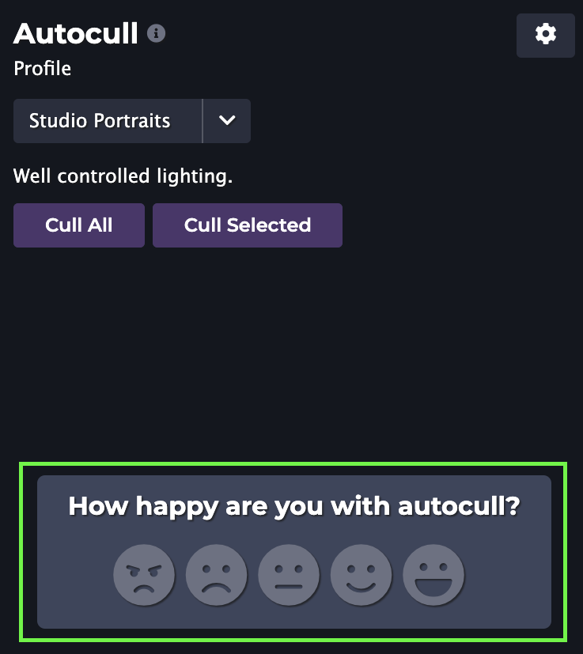

We're very excited to announce the release of Optyx `v1.6` and support for an even wider range of devices!

### M1 Support

Apple released their latest lineup of Macbooks at the end of 2020 with custom Apple-built processors known as the M1 chip. Optyx uses advanced instructions that these processors didn't support, but

<figure>

<figcaption>Optyx now works on Apple M1 devices</figcaption>
</figure>

### Microsoft SmartScreen Improvements

Optyx downloads on Windows should no longer trigger Microsoft SmartScreen filtering warnings thanks to extended verification and a renewed partnership with our parent company. If you see any further anti-virus or malware alerts for Optyx, please let our team know at [support@optyx.app](mailto:support@optyx.app).

Let us know what you think and happy culling!

PS - Have more ideas on what would take your Optyx experience to the next level? Drop us a line at [feedback@optyx.app](mailto:feedback@optyx.app) or checkout our [public roadmap](https://trello.com/b/tP3PX7sw/optyx-app-public-roadmap).
