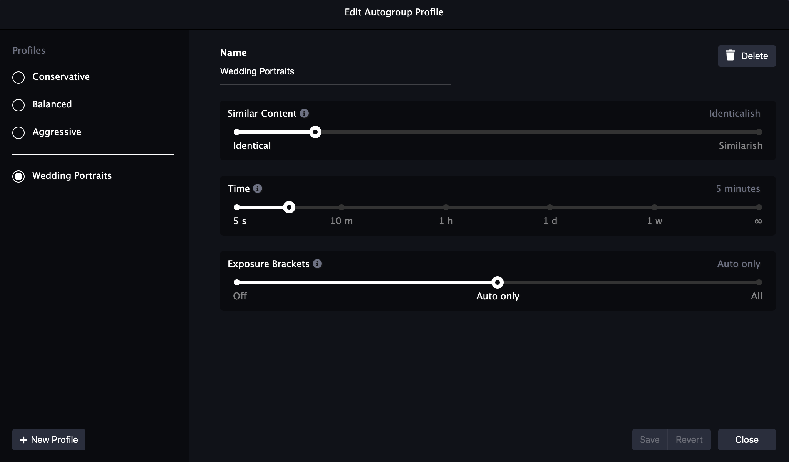

The culling workflow in Optyx is centered around the concept of groups. Similar photos are grouped together based on content, capture time, and exposure bracketing. The best photo of each group is tagged with a rating or color according to the sharpness, exposure, facial expression, eyes open, and basic composition rules relative to others in the group. The complete workflow looks something like the below:

1. Copy photos to a local disk and import them to Optyx.
1. Use Autogroup to instantly group photos based on content similarity.
1. Refine groups with manual overrides.
1. Use Autocull to assign rating and color labels to the best photos in each group.
1. Scan filtered photos for stragglers and adjust metadata with manual overrides.
1. Re-import photos with set metadata to your editor.

## Autogroup

Autogroup creates photo groups based on content similarity with limits based on the time difference. Autogroup can also automatically identify bracketed shots for HDR or exposure stacking. You can control the aggressiveness of each of these options with the autogroup sliders. Sliding a slider to the right will group more photos together while sliding a slider to the left will group fewer photos together.

<figure class="figure-right">

<figcaption>Autogroup sliders in the Optyx app</figcaption>
</figure>

1. **Content Similarity** - Controls grouping by content similarity of the photographs. At its strictest, photos will need to be nearly identical. At its most lenient, photos only need to have similar overall color patterns and structure.
1. **Time** - Controls what photos are _allowed_ to be grouped together. Photos will only be grouped together based on content similarity if the difference between their timestamps is at least this close.
1. **Exposure Brackets** - Controls grouping of multiple exposures. Photos will be grouped together based on exposure compensation information in Auto modes and overall exposure settings in Manual shooting modes.

### Autogroup Profiles

Once you've put together a set of slider combinations that you like, you can save them in an autogroup profile. Open the profiles modal by clicking the settings cog in the top right corner of Autogroup and create as many custom profiles as you need.

<figure>

<figcaption>Autogroup profile settings in the Optyx app</figcaption>
</figure>

## Autocull

Autocull processes each group and tags the best photo. Autocull profiles can be configured to tag photos based on various rules. Default rating-based and color-based profiles are pre-configured, but custom profiles can be added and customized to fit your specific workflow.

The Autocull edit modal allows you to configure any set of conditions and actions you'd like. The actions for each profile will be applied in the order listed. For photos with multiple and conflicting applicable actions, the final action will override a previous action.

<figure>

<figcaption>Autocull profile edit modal in the Optyx app</figcaption>
</figure>

### Conditions

#### Selective Conditions

Selective conditions will have exactly one match within each group if the condition is applicable to the photo. For example, even if every photo is blurry in a group, whichever is _least_ blurry will receive the "sharpest" label. Selective conditions are helpful for selecting photos within a group.

1. **Best Overall** - The best overall photo when all features are considered.
1. **Best Faces** - The photo with the overall best faces, the happiest, sharpest, and most eyes open.
1. **Happiest Faces** - The photo with the happiest faces, regardless of sharpness or squinting eyes.
1. **Sharpest** - The photo with the sharpest edges.
1. **Solo Group** - A photo that is the only photo in its group. When a photo is the only photo in the group, this is the only condition that will match.
1. **Unmatched** - A photo that does not match any other condition. Used as the default handling mechanism.

#### Absolute Conditions

Absolute conditions apply to every photo regardless of its group status. For example, if every photo in a group has blurry faces, each will receive the "Poor Focus" label. Absolute conditions can be helpful for eliminating entire photo groups.

**NOTE: As of Optyx v1.3, only photos with obvious faces are candidates for absolute conditions. See [Face Focus Detection](#face-focus-detection) for more details on how to define sharp and poor focus thresholds.**

1. **Sharp Focus** - Any photo that has all subjects in sharp focus.
1. **Adequate Focus** - Any photo that has at least one subject in sharp focus or a majority of subjects with acceptable focus.
1. **Poor Focus** - Any photo that has a majority of subjects out of focus and no subjects in sharp focus.

### Actions

1. **Set Color Label** - Sets the XMP `Label` property with the specified color. Used for interop with other photo management tools.
1. **Set Rating** - Sets the XMP `Rating` property with the specified rating. Used for interop with other photo management tools.
1. **Set Management** - Sets the [management method](#management-method) to the specified method.
1. **Add Management Bit** - Mutates the [management method](#management-method) to add the specified property.
1. **Remove Management Bit** - Mutates the [management method](#management-method) to remove the specified property.

## Workflows

Once you've built out autogroup and autocull profiles that you like, you can combine them into a **Workflow**. A workflow will run your prefered autogroup profile followed by your preferred autocull profile for total one-click culling.

<figure style="width: 60%; display: inline-block">

<figcaption>Workflow settings in the Optyx app</figcaption>
</figure>

<figure style="width: 30%; display: inline-block; margin-left: 5%;">

<figcaption>Run your workflow with a single click</figcaption>
</figure>

## Face Focus Detection

For photos of people, ensuring the correct faces are in focus is critical in determining which shots are best. **Different lighting conditions will have different sharpness expectations.** A shot in a studio with high-quality strobe lighting should always be extremely sharp while a photo in a dimly lit church with natural light will naturally be less defined. Optyx has two features to aid with face sharpness detection that you can adjust for different situations: face focus highlighting and subject focus labels.

### Face Focus Highlighting

Optyx will automatically highlight out-of-focus faces with a red border when a single photo is selected. The saturation of the border color indicates the degree to which the face is out-of-focus, bright red being very out-of-focus and gray being moderately out-of-focus.

Control the thresholds for face highlighting by dragging the `Face Focus Highlighting` slider in `Optyx > Preferences` (`File > Preferences` on Windows).

<figure style="width: 60%; display: inline-block">

<figcaption>Example of two out-of-focus faces being highlighted in the Optyx App.</figcaption>
</figure>

<figure style="width: 30%; display: inline-block; margin-left: 5%;">

<figcaption>Preference slider to control face focus highlighting threshold.</figcaption>
</figure>

### Subject Focus Labels

Optyx allows you to assign specific metadata based on whether a subject's focus was sharp, adequate, or poor.

Control the expectations for subject focus labels by adjusting the `Face Focus Thresholds` sliders in the autocull profile modal (see [the Autocull section](#autocull) to learn more about how autocull profiles work).

<figure>

<figcaption>Face focus label threshold settings in the Optyx App.</figcaption>
</figure>

The three regions of the sliders represent the three focus labels available. Faces that fall into the green region will be considered to have sharp focus, faces that fall into the red region will be considered to have poor focus, and all faces in the middle will be considered to have adequate focus.

## Management Methods (Locking)

Because Optyx allows you to instantly modify the metadata of very large sets of photo, controls are in place to avoid automatically wiping out manually set ratings. We call these controls "management methods", and they're represented in the Optyx app by a lock icon in the top left corner of a photo tile.

<figure>

<figcaption>Photos under different management methods in the Optyx app. <i>(left to right)</i> Unlocked, Manually Managed (Metadata only), Manually Managed, Completely Locked</figcaption>
</figure>

There are 5 available management methods:

1. **Unlocked** - Photos will be affected by autogroup, autocull, and explicit user input.
1. **Manually Managed (Metadata only)** - Photos will NOT be affected by autocull. Autogroup and explicit user input will continue to have an effect.
1. **Manually Managed (Groups only)** - Photos will NOT be affected by autogroup. Autocull and explicit user input will continue to have an effect.
1. **Manually Managed** - Photos will NOT be affected by autocull or autogroup. Explicit user input will continue to have an effect.
1. **Completely Locked** - Photos will NOT be affected by autocull, autogroup, or explicit user input. The photo's metadata cannot be changed within Optyx until the management method is changed.
