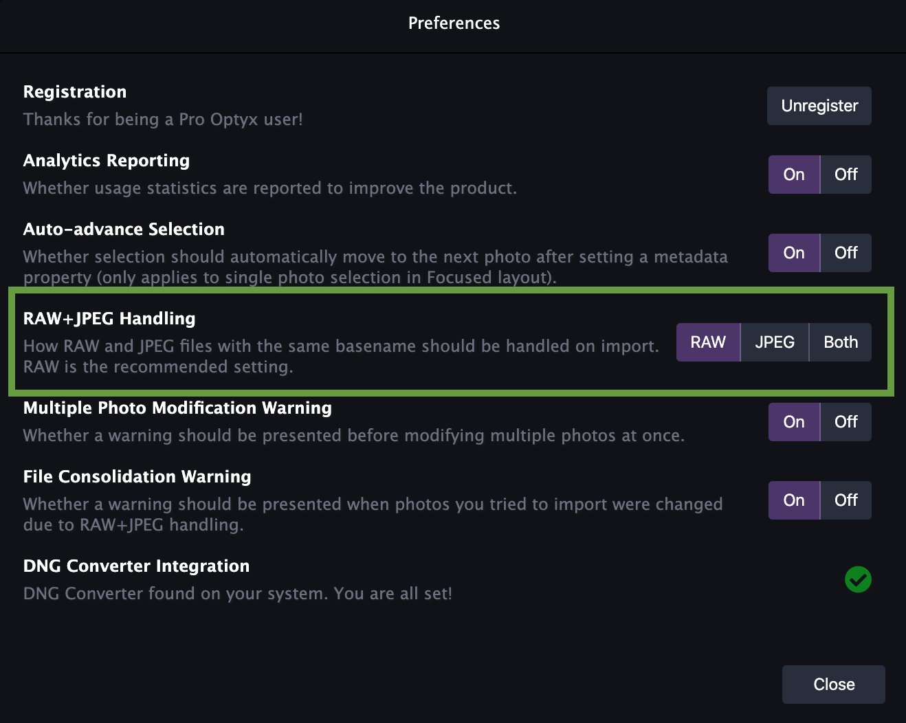

**NOTE**: This guide is intended for photographers who primarily shoot in RAW formats. If you aren't familiar with RAW formats or mostly shoot in JPEG, feel free to skip this.

## Overview

When working with RAW files, Optyx handles its own parsing and primarily works on the JPEG preview for optimal speed. The following RAW formats are all supported out of the box in Optyx, meaning no other dependencies are necessary.

### RAW Formats Supported

| Manufacturer       | Format | Supported |
| ------------------ | ------ | --------- |
| Canon              | .cr2   | ✅        |
| Canon (Mirrorless) | .cr3   | ✅        |
| Sony               | .arw   | ✅        |
| Nikon              | .nef   | ✅        |
| Nikon (Legacy)     | .nrw   | ✅        |
| Fuji               | .raf   | ✅        |
| Panasonic          | .rw2   | ✅        |
| Pentax             | .pef   | ✅        |
| Olympus            | .orf   | ✅        |
| Leica              | .dng   | ✅        |
| Apple (iPhone)     | .dng   | ✅        |
| Samsung (Galaxy)   | .dng   | ✅        |
| Canon (Legacy)     | .crw   | 🚫        |
| Hasselblad         | .3fr   | 🚫        |

## 1:1 Previews with DNG Converter

Working with RAW becomes a little more complicated when handling 1:1 previews. While the most common camera models are supported natively, certain models will require processing with [Adobe's DNG Converter](https://supportdownloads.adobe.com/detail.jsp?ftpID=6809). **You don't need to manually convert files to DNG with the converter in order to handle them in Optyx. Simply install Adobe DNG Converter in the default system location** before building 1:1 Previews in Optyx to automatically take advantage of fullsize 1:1 previews.

If Optyx is unable to find the DNG Converter and you attempt to create previews for a camera model that requires it, you will be prompted to install the converter instead.

## Handling RAW+JPEG Files Simultaneously

Many photographers choose to shoot in RAW+JPEG for faster importing and culling as well as for backups. While Optyx hopefully lessens the need for this process, it still supports several options for handling multiple copies of the same photograph.

- **RAW (Recommended)** - Attempts to import JPEG files with a matching basename of a RAW file will be ignored. Metadata writes will occur in an XMP sidecar.
- **JPEG** - Attempts to import RAW files with a matching basename of a JPEG file will be ignored. Metadata writes will occur directly to the JPEG.
- **Both** - RAW and JPEG files will both be imported regardless of matching basename. Metadata will be managed separately for each copy. Metadata writes to the RAW will occur in an XMP sidecar. Metadata writes to the JPEG will occur directly to the JPEG.

<figure>

<figcaption>RAW+JPEG settings in Optyx Preferences</figcaption>
</figure>

## Troubleshooting

Running into issues with your RAW photos? We want to hear about it! Shoot us an email with a sample of one of your RAW photos to [support@optyx.app](mailto:support@optyx.app) and we'll see what we can do.
