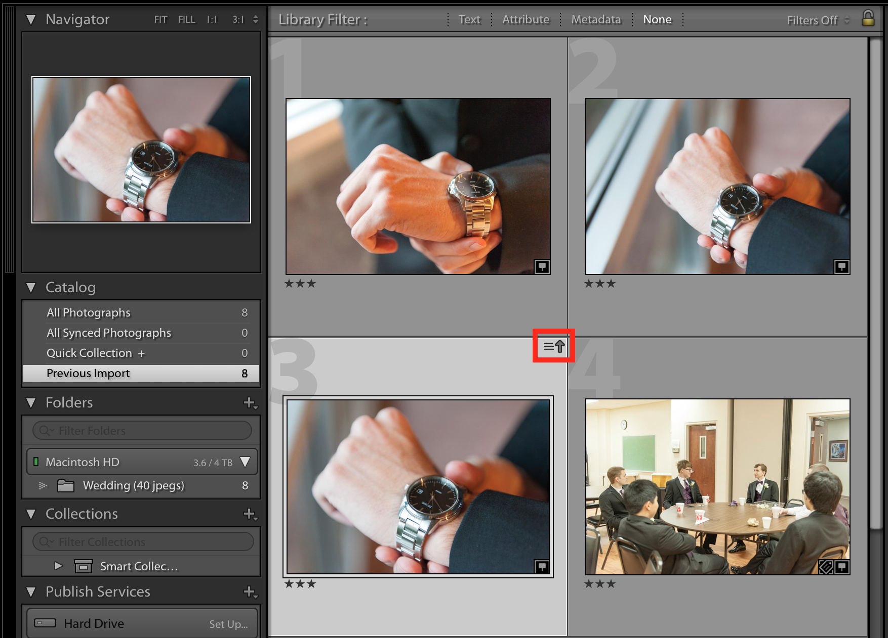

Optyx is designed to work directly alongside your editing software by staying in permanent sync with your photo's metadata on disk. When you set a rating or color label in Optyx the file's metadata is updated immediately and when you set a rating or color label in another program the metadata is visible in Optyx immediately too.

Some programs like Lightroom handle metadata differently though and sometimes conflicts can occur. This guide walks through the optimal workflow to minimize conflicts and maximize your time saved.

Optyx Pro users also have access to the Optyx Connector Lightroom plugin that let's you invoke Optyx autocull from directly within the Lightroom UI. To learn more about working with the plugin, skip to the [Optyx Connector](#optyx-connector) section.

## Recommended Workflow

### New Shoots

1. Import and cull photos in Optyx (See [Getting Started](/tutorials/getting-started)).
1. Select in Optyx the photos you wish to edit.
1. Drag and drop the photos into Lightroom.
1. Edit in Lightroom.

<figure>

<figcaption>Photos in Optyx can be dragged directly into Lightroom.</figcaption>
</figure>

### Existing Shoots

1. **IMPORTANT:** **In Lightroom**, ensure metadata has been written to disk (`Metadata` > `Save Metadata to File`).
1. **In Optyx**, import photos as usual (See [Getting Started](/tutorials/getting-started)).
1. **In Optyx**, [Clear the metadata lock](http://localhost:8000/tutorials/learning-optyx/#management-methods-locking) for any photos you wish to overwrite with autocull.
1. **In Optyx**, cull photos as usual (See [Getting Started](/tutorials/getting-started)).
1. **In Lightroom**, read metadata from files (`Metadata` > `Read Metadata from File`, see [Resolving Conflicts](#resolving-conflicts)).
1. **In Lightroom**, filter and edit as usual.

#### Resolving Conflicts

If you need to go back to culling Optyx after importing into Lightroom, any changes made in Optyx won't be reflected in Lightroom. Instead you'll see a small icon in the top right corner of the photo cell that there are metadata conflicts.

<figure>

<figcaption>Example of metadata conflicts in Lightroom.</figcaption>
</figure>

This is expected and no reason for concern. Click the icon that appeared and select "Import Settings from Disk" in the popup to import the metadata changes made by Optyx.

<figure>

<figcaption>Select "Import Settings from Disk" to import the metadata changes made by Optyx.</figcaption>
</figure>

Alternatively, select your photos with outdated metadata and select `Metadata` > `Read Metadata from File` in the menu bar to update many photos at once.

## Optyx Connector (Experimental)

**WARNING**: The Lightroom plugin API greatly limits the ability of Optyx to process images quickly without errors. Additionally, one of the primary benefits of Optyx is the ability to cull quickly without needing to import _all_ the photos into Lightroom. It is highly recommended that you follow the recommended workflow and only use the Optyx Connector as a last resort. The Optyx Connector is in beta and may not be supported in the future.

Optyx Pro users have access to the Optyx Connector Lightroom plugin that let's you invoke Optyx autocull from directly within the Lightroom UI.

### Features

Optyx was designed from the ground up to work in tandem with Lightroom even without a plugin. A vast majority of the scenarios the plugin offers can be accomplished using the standalone app. However, the Optyx Connector does provide a few unique features:

- Autocull photos without leaving Lightroom.
- Set "Flagged/Rejected" state in Lightroom through Optyx "Picked" results.
- Automatically create a new shoot and begin Optyx import with one click.

### Installation

**Requirements**

- Optyx App (v1.5.0 or later)
- Lightroom Classic (v9.0.0 or later)

**Instructions**

1. Download the Optyx Connector zip file using the [official download link on your Optyx Pro receipt](https://customers.gumroad.com/article/199-how-do-i-access-my-purchase).
1. Unzip the plugin, and move the `.lrplugin` folder to wherever you store Lightroom plugins.  
   Recommendation: create a `Plugins` folder in the same location as your Lightroom catalogs.
1. Open the Lightroom Plugin Manager (`File > Plug-in Manager`) and click `Add` to add the Optyx `.lrplugin` in your chosen location.

<figure>

<figcaption>Use the Plug-in Manager to add the Optyx Connector.</figcaption>
</figure>

### Usage

1. Open the Optyx app. Without minimizing Optyx, switch back to Lightroom.
1. Select photos in Lightroom that you wish to autocull with Optyx.
1. Select `Library > Plug-in Extras > Run Autocull...`.
1. Configure the shoot, autogroup profile, and autocull profile to use for the photos.
1. Wait for the photos to be imported and autoculled. The first time a photo is imported into a shoot, lengthy analysis will need to be computed, but future invocations should be much, much faster.

<figure>

<figcaption>Photos in Lightroom can be imported directly to Optyx via the Optyx Connector plugin.</figcaption>
</figure>

### Limitations

- Optyx Connector is a remote control for the Optyx app. It cannot be used without the Optyx app.
- Optyx cannot be _minimized_ while using the plugin (occlusion of the window by having Lightroom in the foreground is fine).
- Lightroom will not be usable while Optyx Connector is waiting for results.
- Due to limitations in the Lightroom Plugin API, groups in Optyx cannot be replicated as stacks in Lightroom. If you're interested in this functionality, please upvote [the open Adobe feature request](https://feedback.photoshop.com/photoshop_family/topics/lightroom_sdk_stack_ops).

## Troubleshooting

Running into issues using Optyx with your other software? We want to hear about it! Shoot us an email at [support@optyx.app](mailto:support@optyx.app) and we'll see what we can do.
